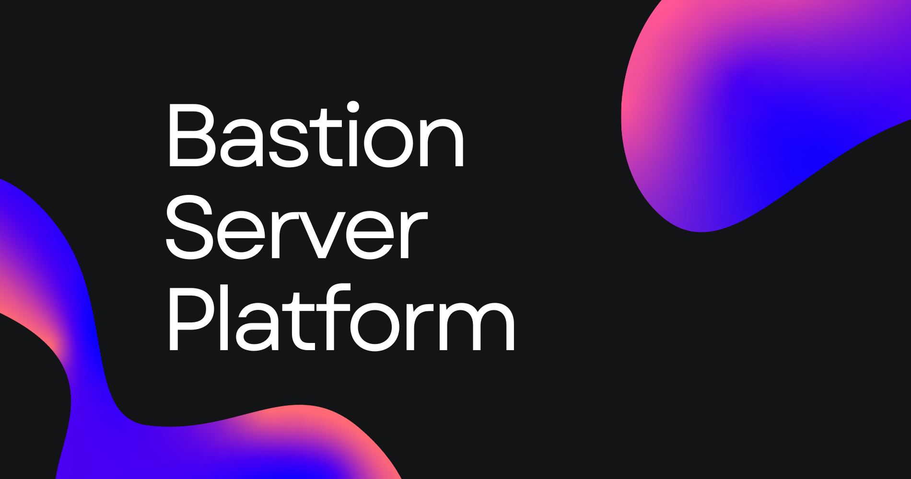

# 🛡️ Bastion Server Platform

  
Open-source, Windows-based server management system designed for Minecraft server hosting. Built with C# and .NET Framework, it provides a sleek web-based panel and powerful backend to manage, start, stop, and monitor your servers — all with a Windows-native approach.

---

## 🚀 Features

- 🔧 **Minecraft Server Management** (Start, Stop, Restart)
- ⚙️ **Plugin/Mod Manager** installs and updates Plugins and Mods quickly for your servers
- 🖥️ **Web-Based Admin Panel** allows easy access, even remotely
- 🔒 **Secure Auth System** with Roles (Admin/User)
- 📜 **Server Logs and Console Output**
- 📦 **File Manager** with Upload/Download/Permissions
- 🔁 **Scheduler & Task Automation**
- 🌐 **Web API** for integrations
- 🖼️ **Modern UI** designed with inspiration from the Material Design Language

---

## 🛠️ Requirements

- Windows 10 or newer recommended
- [.NET Framework 4.7.2](https://dotnet.microsoft.com/download/dotnet-framework/net472)
- [.NET 9.0](https://dotnet.microsoft.com/en-us/download/dotnet/9.0)
- Administrator privileges

---

## 🔧 Installation

1. **Download the Installer from the Releases page:**

    - [https://github.com/BastionDevs/serverplatform/releases/latest](https://github.com/BastionDevs/serverplatform/releases/latest)
    - Get the proper Installer for your system.

2. **Install Server Platform** using the downloaded Installer executable.

3. **Run Server Platform**'s components, including the *Backend* and *Frontend*.

4. **Access the Web Frontend** via the URL shown in the *Frontend* server screen.

5. **Login with the default admin credentials:**

    - **Username:** `admin`  
    - **Password:** `admin123` *(Change this immediately!)*

---

## 📘 Documentation

Documentation is available on our [GitHub wiki](https://github.com/BastionDevs/serverplatform/wiki).

---

## 💬 Community & Support

- 📢 Discord: [discord.gg/EmEG5Eecys](https://discord.gg/EmEG5Eecys)  
- 🐛 Bug reports: Create a new Issue via GitHub  
- 🙋 Feature requests: Submit via Discussions  

---

## 📝 License

This project is licensed under **Bastion GSLP 2.1**. See [LICENSE.md](LICENSE.md) for more details.

---

## ❤️ Contributing

Pull requests are welcome! Please read the [CONTRIBUTING.md](CONTRIBUTING.md) before submitting.

---

## 🙌 Credits

- Concept inspired by [Pterodactyl Panel](https://pterodactyl.io/)  
- Built with ❤️ in C#
